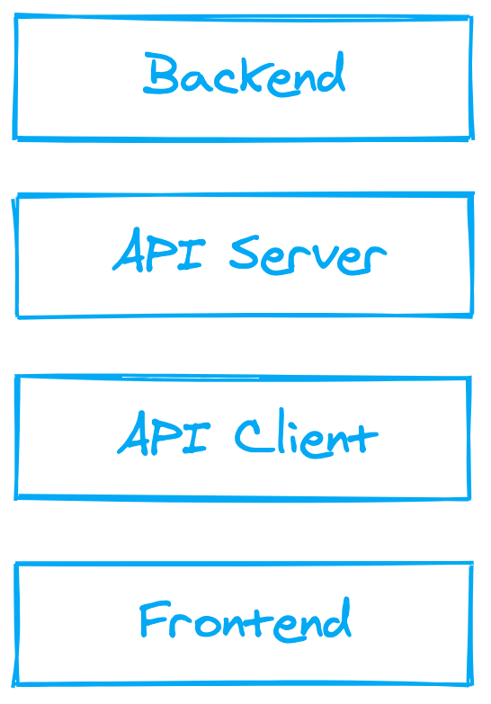
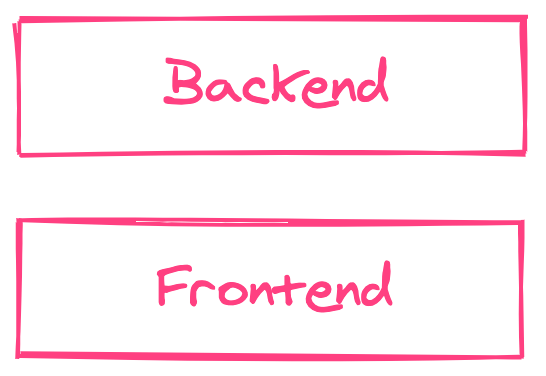

	
	 
	 

## API-Less Architecture

Most modern applications (single-page web apps, mobile apps, etc.) consist of two parts:

- A frontend to manage the user interface.
- A backend to manage business logic and data storage.

To connect the frontend and the backend, a web API (REST, GraphQL, etc.) is generally used, which requires the development of an API client on the frontend side and an API server on the backend side.

We have the following architecture:

	

With an API-less architecture, the frontend can communicate with the backend without the need to build a web API. The backend exposes functions (or methods) that the frontend can call directly, and the developer no longer has to worry about URL paths, HTTP methods, or status codes.

Of course, since the frontend and the backend run in separate environments, there is necessarily an API client and an API server in between, but they are no longer the responsibility of the developer. The API layers are handled by a library or a framework.

So an API-less architecture looks like this:

	

Removing the API layers not only reduces the amount of code the developer has to write, it also improves quality by reducing code scattering and duplication of knowledge.

## Libraries and Frameworks

A growing number of libraries and frameworks allow to implement the API-less architecture.

### JavaScript/TypeScript

| Product                           | Product type | API type        | Real time      | Mobile support | Since |
| --------------------------------- | ------------ | --------------- | -------------- | -------------- | :---: |
| [Meteor](https://www.meteor.com/) | Framework    | Procedural      | Yes            | Yes            | 2012  |
| [Layr](https://layrjs.com/)       | Library      | Object-oriented | On the roadmap | Yes            | 2019  |
| [Blitz.js](https://blitzjs.com/)  | Framework    | Procedural      | No             | On the roadmap | 2020  |
| [Telefunc](https://telefunc.com/) | Library      | Procedural      | On the roadmap | Yes            | 2021  |

## Contributing

Contributions are welcome.

Before contributing please read the [code of conduct](https://github.com/apilessdev/apiless/blob/main/CODE_OF_CONDUCT.md) and search the [issue tracker](https://github.com/apilessdev/apiless/issues) to find out if your issue has already been discussed before.

To contribute, [fork this repository](https://docs.github.com/en/github/getting-started-with-github/fork-a-repo/), commit your changes, and [send a pull request](https://docs.github.com/en/github/collaborating-with-issues-and-pull-requests/about-pull-requests).

## License

MIT
