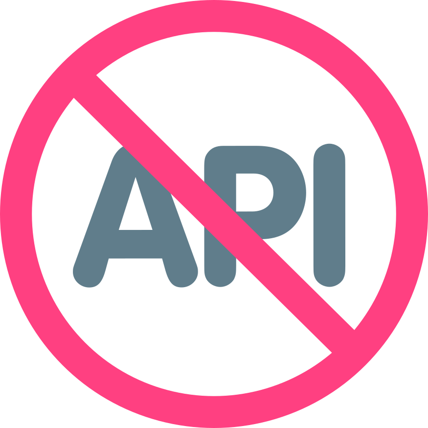

	
	 
	 

## API-Less Architecture

[...]

## Libraries and Frameworks

### JavaScript/TypeScript

| Product                           | Product type | API type        | Real time      | Since |
| --------------------------------- | ------------ | --------------- | -------------- | :---: |
| [Meteor](https://www.meteor.com/) | Framework    | Procedural      | Yes            | 2012  |
| [Layr](https://layrjs.com/)       | Library      | Object-oriented | On the roadmap | 2019  |
| [Blitz.js](https://blitzjs.com/)  | Framework    | Procedural      | No             | 2020  |

## Contributing

Contributions are welcome.

Before contributing please read the [code of conduct](https://github.com/apilessdev/apiless/blob/main/CODE_OF_CONDUCT.md) and search the [issue tracker](https://github.com/apilessdev/apiless/issues) to find out if your issue has already been discussed before.

To contribute, [fork this repository](https://docs.github.com/en/github/getting-started-with-github/fork-a-repo/), commit your changes, and [send a pull request](https://docs.github.com/en/github/collaborating-with-issues-and-pull-requests/about-pull-requests).

## License

MIT
